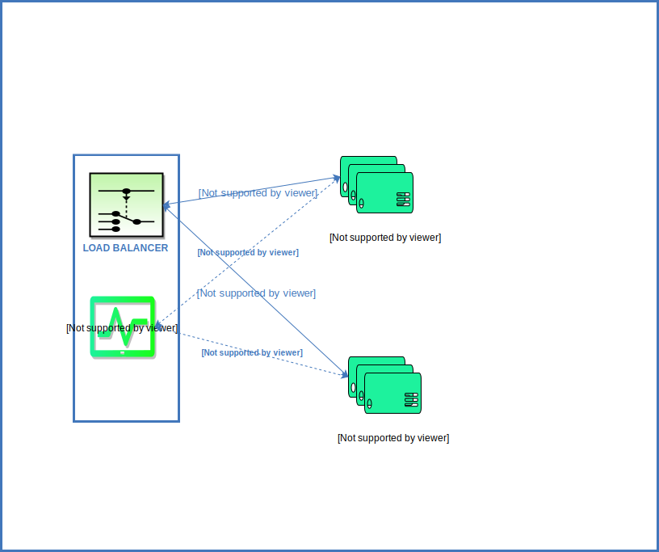

# ProbeD

[](https://travis-ci.org/gojekfarm/probed)

## Description

ProbeD is a transparent health checker service which sits beside a loadbalancer and dynamically remove the upstream services for which health checks fails, Probed is scalable and check health checks asynchronously.

- It currently supports Kong but can be easily extend to any other loadbalancer like haproxy and nginx.
- It support both http and tcp checks.


## Problem it Solves 

Kong prior to .12 does not have health checks and there is no way to remove the faulty upstream servers, which can result in failure of requests while deploying or during maintenance mode.

Probed can be run as side car or co process with Kong and supplement it for the auto removal of the unavailable upstream servers and can help in implementing rolling deployments.

## Installation

```
go get -u github.com/gojekfarm/probed
```

## Deployment 

ProbeD can be deployed as co process/sidecar with the load balancer (Kong) like following diagram, where it automatically fetch the upstream servers and remove those if health check fails.

<p align="center"></p>

## Configuration

Probed can be configure using following flags

```
./probed --help                                                         

Usage of ./build/probed:
  -health-check-interval string
    	health check interval in ms (default "2000")
  -health-check-path string
    	path to check for active health check (default "/ping")
  -health-check-type string
    	supports http or tcp checks (default "tcp")
  -kong string
    	kong host
  -kong-admin-port string
    	kong admin port (default "8001")
  -targets-queue-length int
    	length of the queue for storing targets (default 100)
  -worker-count int
    	no of workers which participate in healthcheck of targets (default 100)

```

## License
```
Copyright 2018, GO-JEK Farm <http://gojek.farm>

Licensed under the Apache License, Version 2.0 (the "License");
you may not use this file except in compliance with the License.
You may obtain a copy of the License at

    http://www.apache.org/licenses/LICENSE-2.0

Unless required by applicable law or agreed to in writing, software
distributed under the License is distributed on an "AS IS" BASIS,
WITHOUT WARRANTIES OR CONDITIONS OF ANY KIND, either express or implied.
See the License for the specific language governing permissions and
limitations under the License.
```
